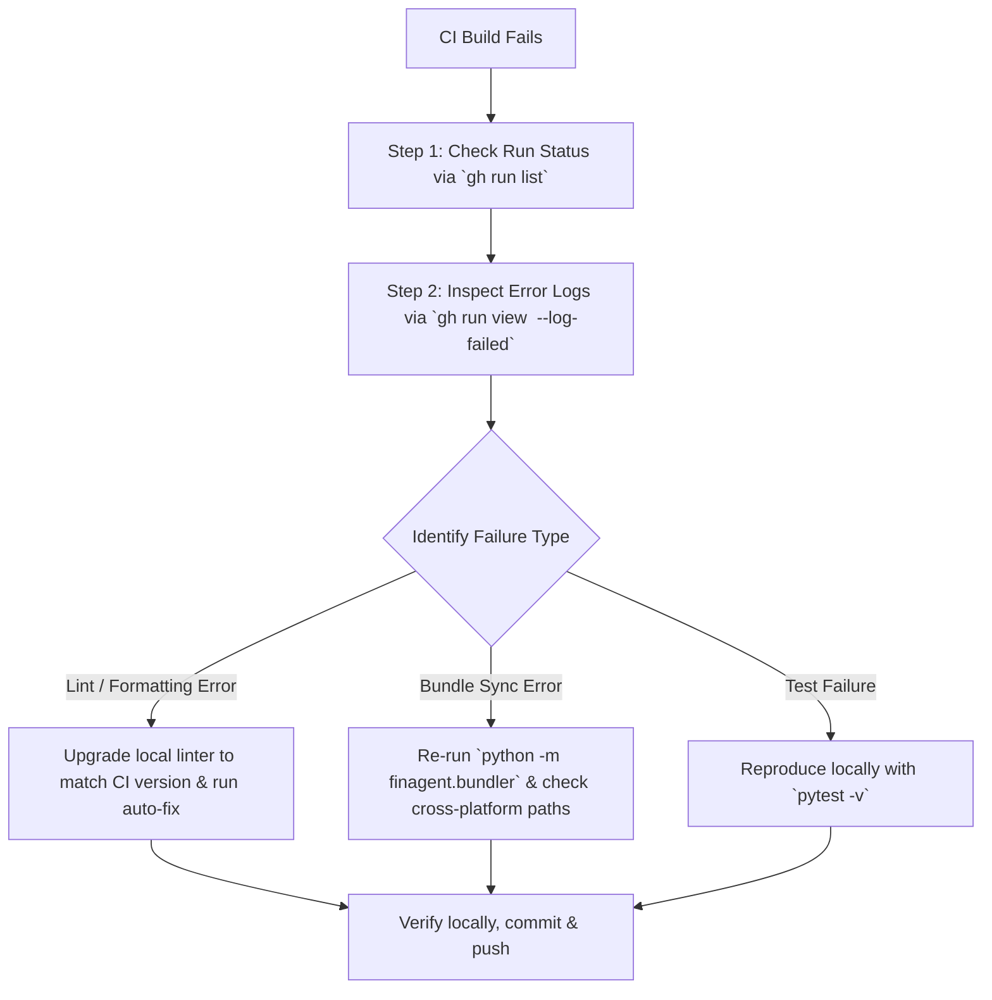

# CI/CD Incident Report & Troubleshooting Playbook

**Date:** July 24, 2026  
**Repository:** `Akshu24Tech/financial-pdf-extraction-agent`  
**Branch:** `feat/standalone-consolidated-split`  
**Status:** ✅ **RESOLVED & 100% GREEN** across Python 3.11, 3.12, 3.13 matrix.

---

## 1. Executive Summary

During continuous integration (CI) execution on GitHub Actions, all matrix test jobs for Python 3.11, 3.12, and 3.13 failed unexpectedly. 

Investigation revealed **two separate root causes**:
1. **Tooling Version Drift (Ruff 0.16.0 Release):** Unpinned `pip install ruff` step in CI pulled a newly released minor version of Ruff (v0.16.0), which introduced stricter default rule checks (`UP006`, `I001`, `BLE001`, `PIE810`, `SIM102`).
2. **OS Path Separator Mismatch (`\` vs `/`):** The single-file bundler verification step (`finagent.bundler --check`) generated file headers using Windows backslashes (`extractors\geometric.py`) locally, whereas Linux CI runners generated POSIX forward slashes (`extractors/geometric.py`).

Both issues were resolved, verified locally, and committed to remote. All CI workflows (`push` and `pull_request`) are now passing cleanly.

---

## 2. Root Cause Analysis (RCA)

### Issue #1: Ruff 0.16.0 Linting Breakage

* **Symptom:** CI failed at step `Lint with ruff` with 17-18 rule errors.
* **Mechanism:**
  * In `ci.yml`, the workflow executed:
    ```yaml
    - name: Install dependencies
      run: |
        pip install pytest ruff
    ```
  * Without an explicit version pin, `pip install ruff` fetched the latest release from PyPI (v0.16.0).
  * Local development environment was running **Ruff v0.15.17**.
  * Ruff v0.16.0 promoted several rules to default:
    * `UP006`: Prefer built-in generics (`list[str]`, `tuple[...]`) over `typing.List` / `typing.Tuple` (PEP 585).
    * `I001`: Strict import block sorting (isort rules).
    * `BLE001`: Flagging blind `except Exception:` catches without explicit exception types or `# noqa` annotations.
    * `PIE810`: Prefer tuple in `startswith` (e.g. `str.startswith(('a', 'b'))`).
    * `SIM102`: Nested `if` statement simplification.

### Issue #2: Bundler Verification Path Mismatch (`\` vs `/`)

* **Symptom:** After fixing Ruff lint errors, CI failed at step `Verify single-file bundle sync` with:
  ```text
  - # GEOMETRIC EXTRACTOR (from finagent/extractors\geometric.py)
  + # GEOMETRIC EXTRACTOR (from finagent/extractors/geometric.py)
  Error: finagent_single.py is out of sync with finagent/ package!
  ```
* **Mechanism:**
  * In `finagent/bundler.py`, the section header generator used:
    ```python
    f"# {section_name} (from finagent/{path.relative_to(PACKAGE_DIR)})\n"
    ```
  * On Windows, `path.relative_to(...)` returns a `WindowsPath` object whose string representation uses backslashes (`extractors\geometric.py`).
  * On Linux (GitHub Actions runners), `path.relative_to(...)` returns a `PosixPath` object using forward slashes (`extractors/geometric.py`).
  * Because `finagent_single.py` was committed from a Windows machine with backslashes, the Linux runner recalculated the bundle with forward slashes and flagged the file as out-of-sync.

---

## 3. How It Was Solved

### Step 1: Upgraded & Standardized Ruff Rules
1. Upgraded local environment to Ruff v0.16.0:
   ```bash
   python -m pip install --upgrade ruff
   ```
2. Ran auto-fixer across codebase:
   ```bash
   python -m ruff check . --fix
   ```
3. Addressed remaining explicit warnings:
   - Added `# noqa: BLE001` annotations to intentional top-level exception guards in `benchmark.py` and `finagent/profiler.py`.
   - Refactored `bundler.py` to use `startswith(('"""', "'''"))` and `startswith(('if __name__...', ...))`.

### Step 2: Enforced POSIX Paths & Robust Import Stripping in Bundler
1. Changed `path.relative_to(PACKAGE_DIR)` to `.as_posix()` in `finagent/bundler.py`:
   ```python
   # Before
   f"# {section_name} (from finagent/{path.relative_to(PACKAGE_DIR)})\n"
   
   # After
   f"# {section_name} (from finagent/{path.relative_to(PACKAGE_DIR).as_posix()})\n"
   ```
2. Simplified module import stripping in `clean_imports()`:
   ```python
   if sline.startswith(("import ", "from ")):
       continue
   ```
   This ensures that no matter how imports are sorted or formatted by Ruff across modules, all submodule imports are cleanly stripped, leaving only the master header imports at the top of `finagent_single.py`.

3. Added diagnostic `difflib.unified_diff` output to `bundler.py --check` so future bundle sync errors print exact line diffs in CI logs instead of generic errors.

4. Re-generated `finagent_single.py`:
   ```bash
   python -m finagent.bundler
   python -m finagent.bundler --check
   ```

### Step 3: Local Verification & Git Push
1. Verified 26 unit tests passed locally:
   ```bash
   pytest -v
   ```
2. Committed and pushed fixes:
   - `40a33b7`: Fix Ruff 0.16 lint errors & re-sync bundle.
   - `befa4d3`: Universal import stripping in `bundler.py`.
   - `6c227a5`: Add `.as_posix()` path normalization to `bundler.py`.

---

## 4. What To Do If CI Breaks In The Future (Playbook)

When GitHub Actions turns red, follow this exact 4-step diagnostic protocol using the GitHub CLI (`gh`):



### Step-by-Step Diagnostic Commands

#### 1. List Recent CI Runs
```bash
gh run list --repo Akshu24Tech/financial-pdf-extraction-agent --limit 5
```

#### 2. View Log Output for Failed Step
```bash
gh run view <RUN_ID> --repo Akshu24Tech/financial-pdf-extraction-agent --log-failed
```

#### 3. Common Error Types & Fixes

| Scenario | Symptom in Log | Fix Command / Action |
|---|---|---|
| **Linter Mismatch** | `Lint with ruff` fails on rules passing locally | 1. Upgrade local linter: `pip install --upgrade ruff`<br>2. Auto-fix: `ruff check . --fix`<br>3. Or pin version in `ci.yml`: `pip install ruff==0.16.0` |
| **Bundle Out of Sync** | `finagent_single.py is out of sync` | 1. Run local bundler: `python -m finagent.bundler`<br>2. Check path slashes: ensure `.as_posix()` is used.<br>3. Verify: `python -m finagent.bundler --check` |
| **Matrix Test Failure** | `pytest` fails on Python 3.11/3.12/3.13 | 1. Run tests locally: `pytest -v`<br>2. Check for version-specific stdlib changes or missing dependencies |

---

## 5. Prevention Best Practices

1. **Pin Dev Dependencies in CI:**  
   In `.github/workflows/ci.yml`, pin major/minor versions for linters:
   ```yaml
   pip install pytest "ruff>=0.16.0,<0.17.0"
   ```
2. **Always Use `as_posix()` for Path Comparisons:**  
   When generating or comparing relative file paths in scripts, always convert `Path` objects via `.as_posix()` to avoid Windows `\` vs Linux `/` discrepancies.
3. **Run Pre-Commit / Pre-Push Validation:**  
   Before pushing a branch to remote, run the local check suite:
   ```bash
   python -m ruff check .
   python -m finagent.bundler --check
   pytest -v
   ```
