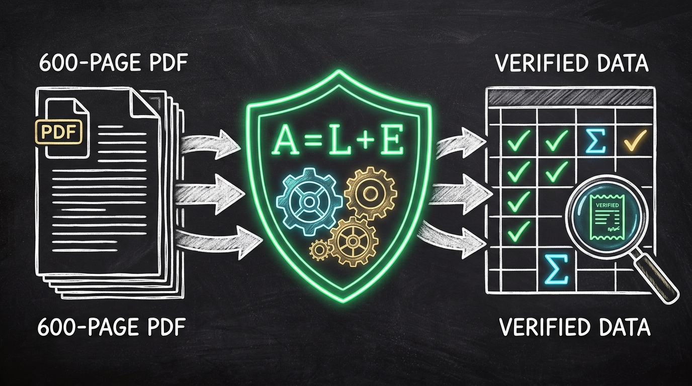

# Master Architecture Blueprint — Viral Thought-Sharing Post

**Status:** READY TO PUBLISH 🚀  
**Topic:** End-to-End System Blueprint: How to Extract Financial Data with 100% Mathematical Proof (No Hallucinations)

---

## 🎨 Attached Graphic Asset



*File location:* `docs/master_architecture_diagram.jpg`

---

## 📱 The Post (Ready to Copy-Paste)

```text
Feeding a 600-page financial PDF into a standard LLM is like asking a golden retriever to audit Fortune 500 taxes. 

It’s super confident, highly enthusiastic, but someone is going to jail. 🐶📊

Why? Because LLMs love to guess. If an AI hallucinates a single digit on a $40B balance sheet or misaligns a column by 2 millimeters, the whole financial model collapses.

So instead of burning $50 in API tokens hoping an LLM gets it right, I built a paranoid 7-stage deterministic AI agent that doesn't trust a single number until it PROVES it with math.

Here’s the architecture of Financial PDF Extraction Agent (v2):

1️⃣ Stage 1: Fast Profiler — Scans 600 pages in <1 sec with pypdf, triage-filtering corrupt/scanned pages.
2️⃣ Stage 2: Geometry Splitter — Uses a 200-bin histogram to split dual-page A3 landscape spreads (like Airtel/Reliance) without cutting wide single tables (like BMW).
3️⃣ Stage 3: Statement Locator — Isolates Balance Sheet, P&L, & Cash Flow and auto-detects scale (₹ Crores vs $ Millions).
4️⃣ Stage 4: Geometric Extractor — Reconstructs borderless tables from floating (x, y) coordinates.
5️⃣ Stage 5: Normalizer — Maps erratic corporate line items to canonical schemas while stripping footnote markers.
6️⃣ Stage 6 & 6b: Mathematical Proof Engine — Evaluates 7 core accounting identities (Assets = Liabilities + Equity) & derives missing items deterministically.
7️⃣ Stage 7: Receipts Engine — Emits colour-coded Excel workbooks with cell-level audit citations (Page #, exact PDF label, proof status).

🏆 The Result:
• 180/180 (100%) accuracy on our hand-verified Golden Suite across Apple, Tesla, BMW, Reliance, and TCS.
• Zero hallucinations. Sub-second execution. 0 LLM token cost.
• Published to PyPI: pip install akshu-finagent

Accuracy in enterprise AI doesn't come from bigger models. It comes from deterministic verification.

GitHub Repo: [Link in Comments]

#AIEngineering #Python #OpenSource #FinancialAI #DocumentAI #SystemDesign #BuildInPublic
```

---

## 💼 LinkedIn Profile — "Projects" Section Template

**Project Name:**  
`Financial PDF Extraction Agent — Autonomous Deterministic Accounting Engine`

**Associated with:**  
`Independent Project / Self-Employed / Your Current Role`

**Dates:**  
`Jun 2026 – Present`

**Project URL:**  
`https://github.com/Akshu24Tech/financial-pdf-extraction-agent`

**Description:**
```text
Designed and open-sourced an autonomous, 7-stage deterministic AI data pipeline that extracts, normalizes, and mathematically validates financial metrics from complex 600-page annual reports (US GAAP, IFRS, Ind AS).

Key Engineering Highlights:
• 100% Mathematical Proof Engine: Replaced error-prone LLM extraction with deterministic spatial parsing and accounting identity verification (A = L + E, composition sums, cross-statement cash ties).
• High-Precision Computer Vision & Geometry: Built a 200-bin word-density histogram gutter detector to automatically split two-up A3 landscape spreads without slicing wide single-page tables.
• Full Audit Trail & Receipts: Generates 5-color trust-taxonomy spreadsheets with cell-level provenance (PDF page citations, raw label text, and mathematical proof receipts).
• 100% Benchmark Accuracy: Achieved 180/180 (100%) metric extraction accuracy across global enterprise test suites (Apple, Tesla, BMW, Reliance, TCS, Infosys).
• Production DevOps & CI/CD: Automated multi-version Python testing (3.11–3.13) and zero-secret OIDC Trusted Publishing to PyPI (pip install akshu-finagent).

Tech Stack: Python, PyPI Packaging, GitHub Actions (OIDC, Matrix Testing), openpyxl, pypdf, pdfplumber, pytest, Ruff.
```

**Skills to Tag:**  
`Python (Programming Language)` · `Data Engineering` · `Document AI` · `CI/CD (GitHub Actions)` · `Software Architecture` · `Financial Analysis` · `Open Source Development`
