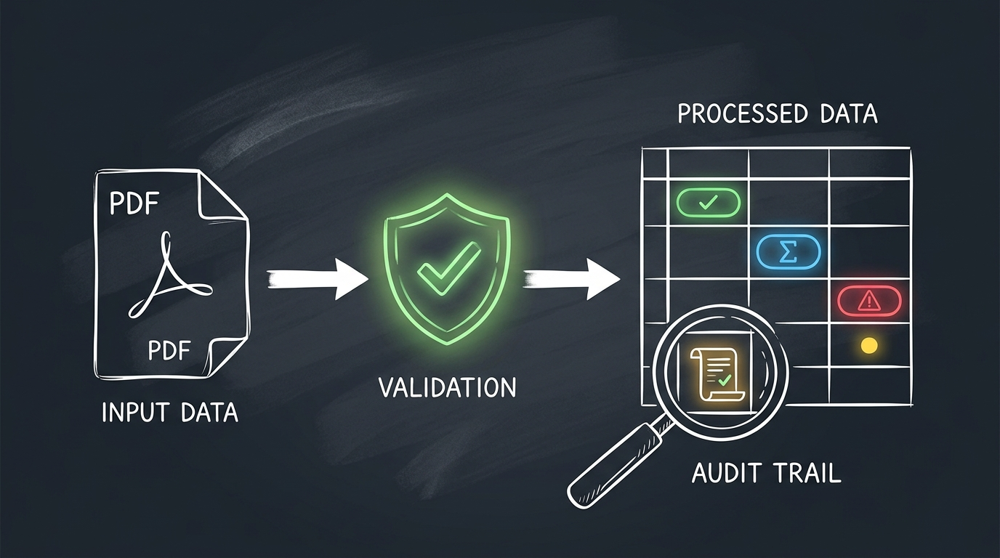
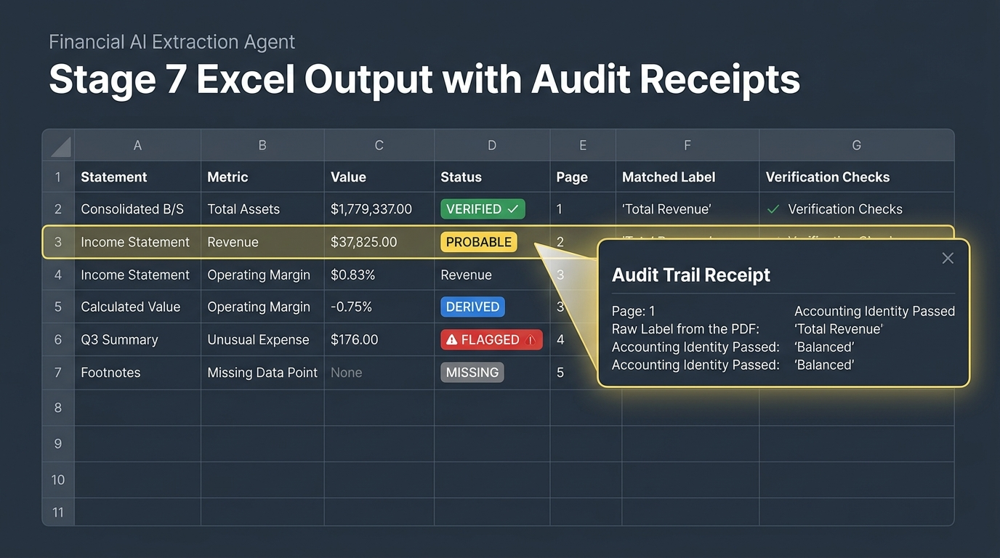

# Stage 7 Architecture Breakdown — LinkedIn Thought-Sharing Post

Status: DRAFTED & ready to publish. Includes visual diagram assets.

---

## Attached Graphic Assets

- **Hand-drawn Sketch Diagram**: 
- **UI Table Mockup**: 

---

## The Post

`
If an AI extracts a financial number without a receipt, an auditor cannot use it.

In stages 1–6 of our Financial PDF Extraction Agent, we:
1. Profiled and deskewed multi-page reports
2. Located Consolidated vs Standalone statements
3. Rebuilt borderless tables from raw coordinates
4. Mapped line items to standard financial taxonomies
5. Math-verified numbers using accounting identities (A = L + E) & arithmetic derivation

Now comes Stage 7: Delivering the output.

Most extraction tools dump raw JSON or flat spreadsheets. We built a Receipts Engine in Excel:

1. The 5-Color Trust Taxonomy:
🟢 VERIFIED — Passed exact accounting proofs.
🟡 PROBABLE — High-confidence label match, no direct arithmetic test.
🔴 FLAGGED — Identity mismatch. We never return confident-but-wrong numbers.
🔵 DERIVED — Unprinted in the PDF, but pinned down mathematically (e.g., Liabilities = Assets - Equity).
⬜ MISSING — Not found. Zero hallucinations.

2. Full Audit Trail per Row:
Every extracted cell carries:
- 1-based page citation
- Raw label text as printed in the PDF text layer
- Exact identity equations passed or failed

3. Dual-Basis Side-by-Side Comparison:
Automatically aligns Consolidated and Standalone statements on one sheet with an automated variance delta (Consolidated vs Standalone difference).

4. Defensive PDF-to-Excel Sanitization:
PDF text layers often carry stray control bytes inside kerning tokens that silently crash openpyxl workbooks. Stage 7 scrubs illegal XML chars at the boundary before writing.

When AI extracts enterprise financial data, accuracy is only table stakes. Verifiable transparency is what makes it production-ready.

#AIEngineering #FinancialAI #Python #BuildInPublic #DataEngineering #DocumentAI #OpenSource
`

---

## Alternate Openers (Hooks)

1. Why we built an AI extraction tool that doesn't trust what it reads.
2. A financial number without an audit receipt is useless to an auditor.
3. Here is how our Financial Extraction Agent delivers 100% verified numbers with audit receipts (Stage 7).
